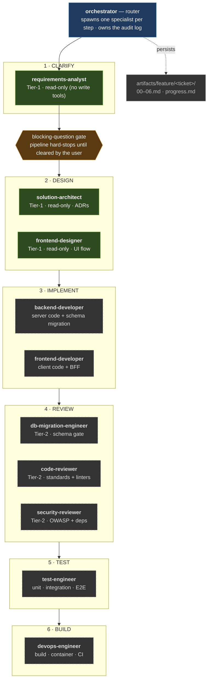

# delivery-team — a multi-agent feature-delivery pipeline (Claude Code plugin)

Take a feature requirement — a story, an epic, a spec — and carry it through
**clarification → system design → UI-flow design → implementation → review → test → build**,
logging every decision, assumption, and implementation detail to durable files that survive
session restarts and are auditable later.

This is a packaged, **stack-agnostic** delivery pipeline. The specialists don't hardcode a
stack — they learn each project's language, build commands, and conventions from that
project's `CLAUDE.md` and `.claude/rules/`. To tune it for a specific project, add an
**overlay**: a `CLAUDE.md` plus path-scoped `.claude/rules/` in the consuming project (see
[`rules/`](rules/) for starters). Project-specific overlays live in the consuming project,
not in this repo.

> **Maturity.** Of the 11 agents, the *advisory* trio (requirements-analyst,
> solution-architect, frontend-designer) plus the orchestrator-as-router have been exercised
> in practice; the *implementation/review/test/build* half has not been run end-to-end yet.
> Treat that half as untested until you've trialled it. See [`docs/architecture.md`](docs/architecture.md).

## Quickstart

Works the same in the **Claude Code CLI, the desktop app, and the IDE extensions** (VS Code /
JetBrains) — the plugin and its commands are identical across all of them.

**Easiest (team, one click):** commit [`settings/install.settings.json`](settings/install.settings.json)
as your project's `.claude/settings.json`. Anyone who opens the repo — CLI **or desktop app** —
gets a single *"Trust this folder + install?"* prompt — confirm once and the marketplace is
added + the plugin enabled. **Desktop GUI (manual):** type `/plugin` → **Marketplaces** tab →
add `okkarkp/sdlcchecker` → **Discover** tab → install `delivery-team` → `/reload-plugins`.
*(The Plugins “Directory” search only browses already-added sources — it can't add a custom repo.)*

```bash
# Manual install (CLI or desktop) — if you're not using install.settings.json
/plugin marketplace add okkarkp/sdlcchecker
/plugin install delivery-team@acnhps-agents
/reload-plugins

# Then: write one story (copy templates/STORY-TEMPLATE.md), and deliver it end-to-end
/delivery-team:deliver docs/stories/PROJ-1-my-feature.md
```

> **Namespacing.** Plugin commands are invoked as `/<plugin>:<command>`, so it's
> `/delivery-team:deliver` and `/delivery-team:self-review` — **not** bare `/deliver`. If you
> just installed, run `/reload-plugins`, then `/help` (or `/plugin`) to see the exact names.
> (In GitHub Copilot the prompt file is invoked as `/deliver` — namespacing is Claude-side only.)

`/delivery-team:deliver` runs clarify → design → implement → review → test → deploy → **verify-and-iterate loop**
→ AC cross-check, logging everything to `artifacts/feature/<ticket>/`. It **stops to ask** if a
requirement is ambiguous, and won't call a feature "done" until every acceptance criterion is
demonstrably met. New here? → **[docs/getting-started.md](docs/getting-started.md)**.

## 📖 Documentation

| Guide | What it covers |
|---|---|
| **[docs/getting-started.md](docs/getting-started.md)** | **Start here.** Mental model · install (2 ways) · day-to-day use · authoring user stories |
| **[docs/for-business-analysts.md](docs/for-business-analysts.md)** | **For BAs (no coding).** Step-by-step: feed a requirement, read the deliverable, answer blocking questions, hand off to design |
| [INSTALL.md](INSTALL.md) | New-user deployment — three install paths (team one-click · `/plugin` · vendoring) |
| [docs/architecture.md](docs/architecture.md) | Design rationale · the pipeline · hook-free write-scope enforcement |
| [docs/enterprise.md](docs/enterprise.md) | Enterprise hardening — what's *enforced* vs. *conventional*, test evidence, what's still owed |
| [templates/CLAUDE.md](templates/CLAUDE.md) | Fill-in-the-blanks project guideline (the full Analyze→Validate methodology) |
| [templates/STORY-TEMPLATE.md](templates/STORY-TEMPLATE.md) | The user-story input format the agents consume |
| [settings/](settings/) | Permission starters — orchestrator allow + enforced reviewer deny |
| [rules/](rules/) | Path-scoped rule starters + universal engineering defaults (`general.md`) |
| [standards/](standards/) | Starter **coding-standards / security-rules (OWASP-mapped) / api-standards** to adopt out of the box |

## The pipeline

The orchestrator runs the requirement through six stages, spawning one specialist per step and
owning the per-feature audit log. Green = exercised in practice; dashed = not yet run end-to-end.



Agents are never auto-triggered — work is routed through `@orchestrator`, which decides which
specialists to spawn (or `@`-mention one for a one-off). The stack-specific details each
specialist uses (build tool, migration framework, test stack, lint/SAST tooling) are discovered
from the consuming project's `CLAUDE.md` and `.claude/rules/`, not hardcoded here.

## The roster (11 agents)

| Agent | Stage | Responsibility | Tools |
|---|---|---|---|
| **orchestrator** | all | Breaks the requirement into tasks, spawns specialists, owns the feature log, runs resume/checkpoint logic | Agent, Read, Edit, Write, Bash, Grep, Glob, WebSearch |
| **requirements-analyst** | clarify | Clarification questions + explicit assumptions register before any design | **read-only** (Read, Grep, Glob) |
| **solution-architect** | design | Architectural decisions, ADRs, cross-module design | **read-only** (Read, Grep, Glob, WebSearch) |
| **frontend-designer** | design | UI-flow, screen specs, design tokens | **read-only** (Read, Glob, Grep) |
| **backend-developer** | implement | Server-side code; authors an entity **and** its schema migration together | Read, Edit, Write, Bash, Grep, Glob |
| **frontend-developer** | implement | Client-side code and any BFF/middleware | Read, Edit, Write, Bash, Grep, Glob |
| **db-migration-engineer** | review | Schema-review gate over the migrations the backend authored | Read, Grep, Glob, Bash, Write |
| **code-reviewer** | review | Coding-standards review + runs the project's real linters/scanners | Read, Grep, Glob, Bash, Write |
| **security-reviewer** | review | OWASP Top 10, auth, secrets + dependency scan | Read, Grep, Glob, Bash, Write |
| **test-engineer** | test | Unit + integration tests; E2E when the stack is up | Read, Edit, Write, Bash, Grep, Glob |
| **devops-engineer** | build | Build, container, CI/CD for the touched module(s) | Bash, Read, Edit, Write |

## Write-scope tiering (hook-free)

- **Tier 1 — hard read-only.** requirements-analyst, solution-architect, frontend-designer
  have **no write/shell tools at all** — they cannot touch the repo. They *return* their
  deliverable as their final message and the **orchestrator persists it** to the artifact file.
  This is the strongest guarantee available without hooks, and it survives plugin packaging
  because it comes from the `tools:` allow-list, not from `permissionMode`.
- **Tier 2 — soft read-only.** code-reviewer, security-reviewer, db-migration-engineer need
  `Bash` to run real scanners, so "never edits source" is enforced by **convention** plus an
  optional project-level `settings.json` deny rule (see [Permissions](#permissions)). They
  write only their own `05-review.md`. For enterprise/regulated use, **enforce** it by running
  reviewers with the shipped [`settings/settings.reviewer.json`](settings/) (denies source writes).

> **Enterprise hardening.** The agents embed the enterprise discipline — authoritative-spec-governs,
> operational sense-check, gate-green ≠ requirement-complete, a mandatory independent adversarial
> AC cross-check before "done", shared-primitive prerequisites, and honest "N/A — not configured"
> over faked gates. See [`docs/enterprise.md`](docs/enterprise.md) for what is enforced vs.
> conventional, the test evidence, and what is still owed before "certified enterprise-grade".

## Install

```bash
# 1. Add this repo as a marketplace (local path, a git URL, or owner/repo on GitHub)
/plugin marketplace add okkarkp/sdlcchecker
#   or, from a local clone:  /plugin marketplace add /path/to/sdlcchecker

# 2. Install the plugin from it
/plugin install delivery-team@acnhps-agents
```

**No Python (or anything) to install.** The plugin is markdown — the orchestrator, the 11 agents,
and the 2 commands. Installing copies those files; nothing is compiled or run as a service. The
`scripts/` (harness, validator, mutation gate) are **optional power-ups** — see `scripts/README.md`;
the pipeline runs without them (verification just runs your project's own test/build command).

Once installed, start a feature by routing the requirement through the orchestrator:

```
@orchestrator deliver the feature described in docs/specs/my-feature.md
```

## Usage notes

- **The orchestrator is the entry point.** Agents are never auto-triggered — invoke
  `@orchestrator` (or an individual specialist by `@name` for a one-off).
- **Per-feature audit log.** The orchestrator copies `templates/feature/` to
  `artifacts/feature/<ticket>/` and maintains `progress.md` + `00`–`06` there.
- **Resume.** `@orchestrator resume <ticket>` greps for the `IN PROGRESS` marker, reloads
  `progress.md`, and continues from the first unchecked item.
- **Per-project tuning.** Drop a `CLAUDE.md` and (optionally) path-scoped `.claude/rules/`
  into the consuming project so the specialists pick up your stack, build commands, and
  conventions. Generic starter rules are in [`rules/`](rules/) — copy and edit the globs.

## Permissions

A plugin **cannot ship a tool-permission allowlist** — permissions are project/user level.
Two ready-to-merge starters ship in [`settings/`](settings/):

- **`settings/settings.json`** — merge into the consuming project's `.claude/settings.json` (or
  `settings.local.json`) so the orchestrator can persist `artifacts/feature/**` + `docs/decisions/**`
  without an approval prompt on every write:

  ```json
  {
    "permissions": {
      "allow": [
        "Write(artifacts/feature/**)",
        "Edit(artifacts/feature/**)",
        "Write(docs/decisions/**)",
        "Edit(docs/decisions/**)"
      ]
    }
  }
  ```

- **`settings/settings.reviewer.json`** — load it as the settings for a **dedicated reviewer
  session** to **deny** writes to your source paths, turning the Tier-2 "soft read-only"
  convention into a hard, enforced guarantee. Edit the deny globs to match your source roots.

## Caveats when running as a plugin

- **`permissionMode` and `mcpServers` in agent frontmatter are ignored** for plugin-loaded
  agents. The implementer agents therefore prompt for edit approval unless you grant
  permissions as above. If you want a design-tool MCP (e.g. Figma) for the frontend-designer,
  configure it at project/user level — it won't auto-attach from the plugin.
- **Tier-1 read-only is unaffected** — it relies on `tools:`, which plugins honour.
- **`${CLAUDE_PLUGIN_ROOT}`** is how the orchestrator locates the shipped `templates/`.
  If your environment doesn't expose it to the agent shell, vendor `templates/feature/`
  into the project at `.claude/templates/feature/` (the orchestrator falls back to that path).

## Tuning for a specific project

The agents are generic. To make them sharp for a given project, give that project:

1. A root `CLAUDE.md` stating the stack, build/test commands, and where the standards docs
   live (coding standards, API standards, security rules, testing guide, etc.). A
   fill-in-the-blanks starter — the full Analyze→Validate methodology with a Project Facts /
   canonical-commands table — ships at [`templates/CLAUDE.md`](templates/CLAUDE.md); copy it to
   your project root and complete §0.
2. Path-scoped `.claude/rules/` (copy from [`rules/`](rules/) and edit the globs) that point
   the agents at those docs for the relevant directories.

The orchestrator reads all of this in its pre-brief and passes it downstream, so the
specialists behave as if purpose-built for that stack — while the same plugin still works in
any other project.

## Quality gates & failure handling

The orchestrator treats **every stage as a gate** with a binary status (GREEN / RED /
SKIPPED), recorded in each feature's `progress.md` **Gate ledger**. A RED gate (a Critical
review finding, a new high/critical vuln, a failing test, or a broken build) never advances
the pipeline: the orchestrator runs a **bounded remediation loop** — re-spawning the owning
specialist with the specific findings, at most twice — and **escalates to the user** if the
gate is still RED. It never disables a check or marks a finding "won't fix" on its own
authority. A feature only flips to `DONE` after the **Definition-of-Done** gate passes (all
gates GREEN/SKIPPED, every acceptance criterion mapped to evidence, no open Critical, build
GREEN); otherwise it is reported `PARTIAL`.

## Requirement intake (any source format)

Sources arrive in many formats. The advisory agents read text, markdown, CSV, images, and
**PDFs** directly. For binary office formats (`.xlsx`/`.docx`) the orchestrator normalizes
them to markdown/CSV under `artifacts/feature/<ticket>/00-source/` first — preserving the
original and recording the conversion command and any dropped data for audit — then hands the
analyst the normalized artifact. Backlog exports are normalized **column-complete** so the
analyst reads every field of every story, not just the summary.

## Validation / CI

The plugin ships no executable code, so "CI" means proving the artifact is well-formed.
`scripts/validate_plugin.py` checks the JSON manifests, every agent's YAML frontmatter, the
tool allowlist (catches typo'd tool names that silently disable an agent), `@agent`
cross-references, README/agent-count consistency, and the template scaffold. Run it locally
with `python3 scripts/validate_plugin.py` (needs `pip install pyyaml`); it also runs on every
push and PR via [`.github/workflows/validate.yml`](.github/workflows/validate.yml).

## Layout

```
.claude-plugin/{plugin.json, marketplace.json}
agents/            11 agents — orchestrator + 10 specialists (stack-agnostic)
commands/          /self-review slash command
scripts/           validate_plugin.py — structural validator (CI gate)
.github/workflows/ validate.yml — runs the validator on push/PR
templates/CLAUDE.md   fill-in-the-blanks project guideline (full Analyze→Validate methodology)
templates/STORY-TEMPLATE.md  one-story-per-file input format the agents consume
templates/feature/ the audit-log scaffold (progress.md + 00–06) + ADR-TEMPLATE.md
rules/             generic path-scoped rule starters to copy into a project
standards/         starter coding-standards / security-rules (OWASP) / api-standards docs
settings/          ready-to-merge permission starters (orchestrator allow + reviewer deny)
docs/architecture.md  design rationale (the briefing)
docs/enterprise.md    enterprise hardening: enforced-vs-conventional, evidence, what's owed
```
